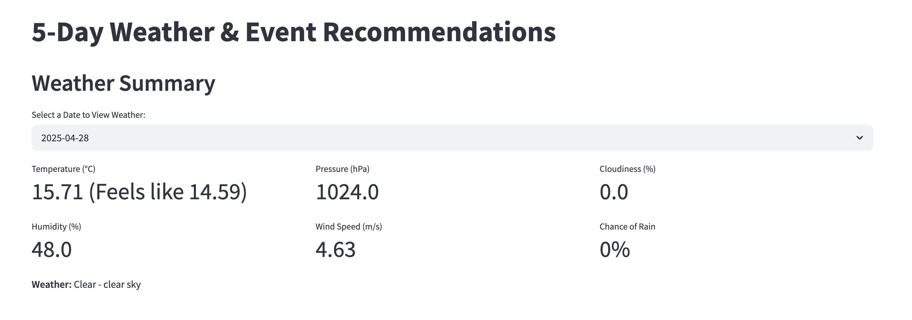

# weather-event-etl

# project-repo
# Weather & Event ETL Pipeline

This project demonstrates an automated ETL pipeline that fetches weather forecasts and event listings, matches them by date, and generates event recommendations based on weather comfort. Final results are saved as CSV files and automatically uploaded to GitHub.

## Features

- **Weather Forecast Fetching**: Uses OpenWeatherMap API for current and 5-day forecasts.
- **Event Data Fetching**: Uses Ticketmaster API to retrieve upcoming events in New York City.
- **Data Validation**: Ensures data integrity using Pandera.
- **Recommendation Logic**: Matches events with weather forecasts and generates textual recommendations.
- **Automation**: Orchestrated via Prefect Cloud with daily scheduled runs.
- **Auto GitHub Upload**: Uploads latest CSV outputs directly to a GitHub repository via GitHub API.

## Directory Structure

```
weather-event-etl/
├── etl_pipeline.py             # Main Prefect flow
├── event_api.py                # Ticketmaster data extraction
├── weather_api.py              # Weather API extraction
├── recommendation.py          # Comfort scoring and recommendation
├── transform.py               # Pandera data validation
├── load.py                    # Save output CSVs
├── upload_github.py          # Upload to GitHub using API
├── output/
│   ├── events_forecast.csv
│   └── weather_forecast.csv
├── .gitignore
├── prefect.yaml               # Prefect deployment spec
└── README.md
```

## Setup

### 1. Environment Setup

```bash
conda create -n mynewenv python=3.12
conda activate mynewenv
pip install -r requirements.txt
```

### 2. Environment Variables

Create a `.env` file or export manually:

```bash
export WEATHER_API_KEY="your_openweather_key"
export EVENT_API_KEY="your_ticketmaster_key"
export GITHUB_TOKEN="your_github_pat"
```

### 3. Prefect Setup

```bash
prefect cloud login
prefect profile use cloud
prefect work-pool create default-agent-pool --type process
prefect deploy --all
```

Set environment variables for deployments inside `prefect.yaml`:

```yaml
job_variables:
  env:
    WEATHER_API_KEY: ${WEATHER_API_KEY}
    EVENT_API_KEY: ${EVENT_API_KEY}
    GITHUB_TOKEN: ${GITHUB_TOKEN}
```

### 4. Manual Local Run

```bash
python etl_pipeline.py
```

### 5. Run via Prefect Cloud

```bash
prefect deployment run 'Daily ETL Pipeline/daily-weather-event-pipeline'
```

## Recommendation Logic

Events are categorized based on daily weather:

- **Comfortable** → Recommended (Outdoor)
- **Moderate** → Recommended (Indoor OK)
- **Uncomfortable** → Recommended (Indoor) or Not Recommended

## Screenshots

- **Weather Dashboard**: 
- **Event Recommendation**: 

## GitHub Upload

Files are uploaded to GitHub using the [Contents API](https://docs.github.com/en/rest/repos/contents?apiVersion=2022-11-28):

- `output/weather_forecast.csv`
- `output/events_forecast.csv`

## Notes

- All credentials are securely passed as environment variables.
- You must **not commit** `.env` or `prefect.yaml` with real secrets.
- `prefect.yaml` is `.gitignore` after deployment.

## License

MIT License © Samantha Wang